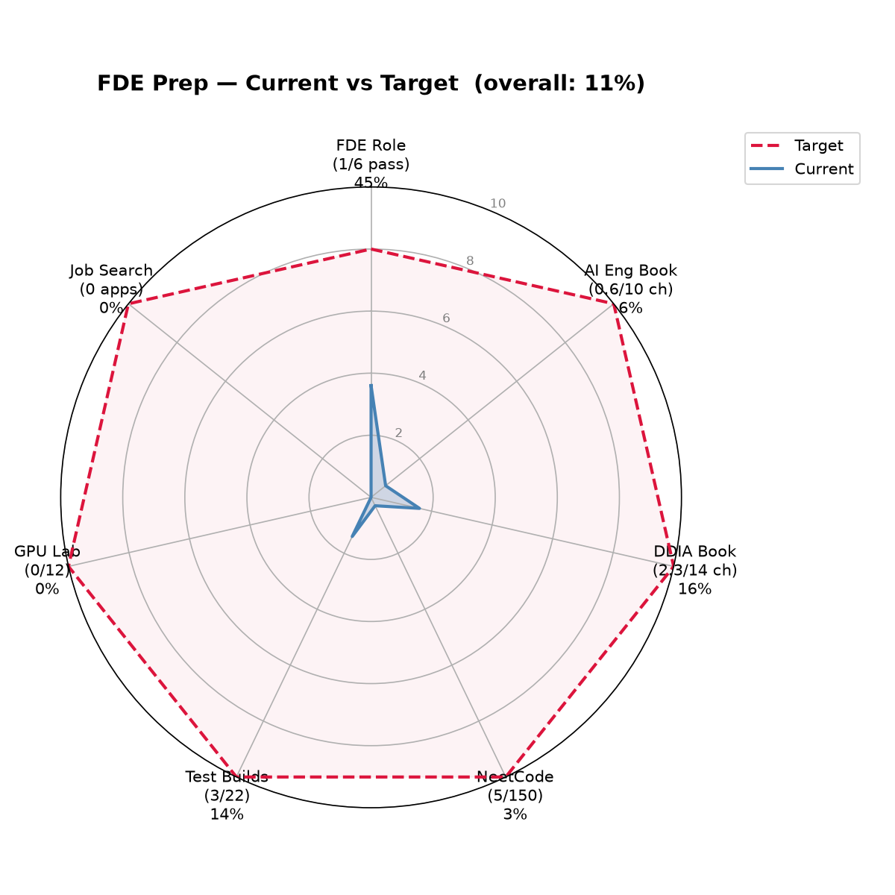

# Progress Overview

Personal tracker for FDE interview prep + book study. Not part of the
public README (that's the awesome-list). Updated as sessions happen.

## Current vs Target

Snapshot as of 2026-09-11. Scores (0-10 scale) pulled from this file's
status rows, shown as current/target and %:
- FDE Role 3.6/8 (45%)
- AI Eng book 0.6/10 (6%)
- DDIA book 1.6/10 (16%)
- NeetCode 0.3/10 (3%)
- Builds 1.4/10 (14%)
- GPU Lab 0/10 (0%)
- Job Search 0/10 (0%)
- **Overall: 12%**

Stale after every session that touches a row below — regen with
`python3 assets/progress-radar.py` after updating the `current` list
in that script to match new numbers.

Two file templates in use, now structurally aligned:

- **Interview-prep template** (`Test FDE Role/`): `findings.md` (research,
  ~ `source.md`), `knowledge-map.md` (target concepts, sourced from
  AWESOME-FDE-RESOURCES.md's curriculum/glossary + findings.md), `knowledge-tracker.md`
  (mastery state, gaps, full question log, misconceptions), `scoreboard.md`
  (fast-glance 6-category scores + session log + pass/fail rule — no
  `session-log.md` equivalent needed since scoreboard's own session table
  covers it).
- **Book-chapter template** (`Test Book Knowledge/<Book>-Chapter-N-<Title>/`):
  `source.md` (condensed chapter capture), `knowledge-map.md` (target
  concepts for question generation), `knowledge-tracker.md` (mastery
  state, gaps, question log, misconceptions), `session-log.md` (session
  history).
- **Coding-practice template** (`Test Leet/`): same shape as the
  book-chapter template minus `source.md` (each problem links straight
  to LeetCode instead of needing a condensed capture) —
  `knowledge-map.md` (full 150-problem checklist), `knowledge-tracker.md`
  (mastery state, gaps, question log, misconceptions), `session-log.md`
  (session history).

---

## Daily Schedule (FDE ASAP — full send)

Repeatable daily template, not a monthly calendar. Content rotates by
simple rule (round-robin/sequential backlog), not fixed dates. Day 1 =
2026-09-08.

| Time | Block | What fills it |
|---|---|---|
| 7:30–9:00 | Leetcode (1.5h) | Spaced-rep reviews due today first (`Test Leet/review-schedule.md`). Then new problems, sequential NeetCode 150 order. |
| 9:00–11:00 | FDE Role drills (2h) | Round-robin 6 categories, 1/day: tech-depth → system-design → problem-decomp → customer-facing → behavioral → business, repeat. Day 1 override: technical-depth first. |
| 11:00–12:30 | Book study (1.5h) | Alternate DDIA next chapter / AI Eng next chapter. Retest flagged weak concepts first (H8, H15, C5), then new material. |
| — nap + Dhuhr 12:30–1:30 — | | |
| 1:30–3:30 | Builds (2h) | Fixed order P5→P1→P4→P3→P2. Stay on one project till built + story logged in `interview-stories/`, then move on. |
| 3:30–4:30 | Behavioral (1h) | Day 1-3 override: fill `star-stories.md` completely (B1a-d, B4a, B5a-c, B6a-g). After filled: drill recall against it. |
| — Asr 4:30–5:00 — | | |
| 5:00–6:45 | GPU Lab (1.75h) | Fixed order G1→G12. One experiment/session till done + story logged. |
| — nap + Maghrib 6:45–7:45 — | | |
| 7:45–8:15 | Job Search (30min) | Non-negotiable daily minimum: 1 application sent OR 1 networking touch. Started day 1, doesn't wait for full prep. |
| — Isha 8:15–8:45 — | | |
| 8:45–10:45 | FDE mock practice (2h) | Once all 6 categories have ≥1 pass: scenario-bank / mock-loop / take-home-practice rotation. Until then: extra rep on today's weakest category. |
| 10:45–midnight | Wrap (1h15) | Update this file's rows touched today (see Maintenance note). Re-skim today's weak flags once. Queue tomorrow's due items. |

---

## 1. FDE Role — Interview Prep

Folder: [`Test FDE Role/`](Test%20FDE%20Role/)

| File | Purpose |
|---|---|
| [findings.md](Test%20FDE%20Role/findings.md) | Research on FDE role/interview process (target companies: OpenAI, Cohere, Anthropic) |
| [interview-stories/](Test%20FDE%20Role/interview-stories/) | Real candidate interview accounts per company (OpenAI, Cohere, Anthropic), used to calibrate question difficulty/framing |
| [scoreboard.md](Test%20FDE%20Role/scoreboard.md) | Fast-glance 6-category score tracker (target: 8/10 in all) |
| [anthropic-openai-stack.md](Test%20FDE%20Role/anthropic-openai-stack.md) | Curriculum reference: Claude API/Agent SDK/MCP + OpenAI Responses API/Agents SDK (AWESOME-FDE-RESOURCES.md's curriculum is GCP-centric, doesn't cover this) |
| [glossary-and-dependencies.md](Test%20FDE%20Role/glossary-and-dependencies.md) | Glossary terms + dependencies that span more than one category |
| [technical-depth/](Test%20FDE%20Role/technical-depth/) | Category 1: generic coding/data + AI-specific (RAG, evals, agent/MCP) — knowledge-map.md + knowledge-tracker.md |
| [system-design/](Test%20FDE%20Role/system-design/) | Category 2: GCP-centric architecture — knowledge-map.md + knowledge-tracker.md |
| [problem-decomposition/](Test%20FDE%20Role/problem-decomposition/) | Category 3: concepts + scenario bank/attempt log — knowledge-map.md + knowledge-tracker.md |
| [customer-facing-judgment/](Test%20FDE%20Role/customer-facing-judgment/) | Category 4 — knowledge-map.md + knowledge-tracker.md |
| [behavioral/](Test%20FDE%20Role/behavioral/) | Category 5 + star-stories.md (personal STAR bank, empty, needs filling) |
| [business-judgment/](Test%20FDE%20Role/business-judgment/) | Category 6 — knowledge-map.md + knowledge-tracker.md |
| [cohere-stack.md](Test%20FDE%20Role/cohere-stack.md) | Curriculum reference: Cohere's Command models, Embed/Rerank, North — lower depth than the OpenAI/Anthropic doc since Cohere's loop isn't API-trivia-heavy |
| [architecture-presentation.md](Test%20FDE%20Role/architecture-presentation.md) | Scaffold for Cohere's Architecture Presentation round (real-project narrative) — empty, needs filling |
| [primary-sources/](Test%20FDE%20Role/primary-sources/) | Reading list + notes for primary policy docs (Anthropic RSP, OpenAI safety practices, Cohere positioning) — 0/4 read |
| [take-home-practice/](Test%20FDE%20Role/take-home-practice/) | Timed take-home-build reps (OpenAI ~5hr+video / Anthropic 3-4hr style briefs) — 0 attempted |
| [mock-loop/](Test%20FDE%20Role/mock-loop/) | Full chained multi-round simulation per company — 0 runs |

**Status:** 3/6 categories started, 1/6 PASS (system design).

- **System design** — PASS (9/10), 2 attempts, both S20 Eval-harness-first.
  - Q1 (healthcare triage) 7/10 — negotiating stakeholder agreement arrived last/narrow instead of leading.
  - Q2 retest (fintech SAR-triage) 9/10 — led with the negotiation move first, sequencing gap fixed, audit checkpoint correctly preserved (revised up from an initial 8 after retracting an assistant misread). Residual gap: surfacing launch-time risk tradeoffs explicitly.
- **Technical depth** — IN PROGRESS, 3 questions attempted, both flagged for retest.
  - T3 Medallion Architecture — don't-know (1/10) then retest 5/10 (correct layers/immutability, missing recovery mechanism).
  - T1 Advanced SQL — 6/10 (correct seq-scan/index diagnosis, single-cause thinking, missed stale stats/function-wrapped predicates/join strategy).
- **Problem decomposition** — IN PROGRESS (7/10), 1 scenario attempted (CS1, 911 response times).
  - Excellent clarifying-question phase (self-discovered the CAD batch-only/no-live-status constraint) and strong prioritization (quick-wins-first, correct travel-time triage).
  - Gap: to-be architecture proposed AI dispatch without officer confirmation, contradicting that same self-discovered constraint; no rollout/evaluation plan for a high-stakes automation proposal.
  - Follow-up discussion refined this live: correctly defended that a future system could have self-reported live status, then correctly re-affirmed acknowledgment should stay (self-reported status can go stale under duress). Score unchanged, but reclassified as "doesn't surface unprompted" rather than "doesn't understand."
- **Other 3 categories** (customer-facing judgment, behavioral, business judgment) — 0 attempts.
- Anthropic added as a target company + interview story 2026-09-06; `star-stories.md` needs personal stories filled in before real loops.
- New pieces added 2026-09-06 (`cohere-stack.md`, `architecture-presentation.md`, `primary-sources/`, `take-home-practice/`, `mock-loop/`) — all at 0 attempts/empty, structural coverage only, no reps yet.

---

## 2. AI Engineering: Building Applications with Foundation Models (Chip Huyen)

Source PDFs: [`Book - AI Engineering - Building Applications with Foundational Models/`](Book%20-%20AI%20Engineering%20-%20Building%20Applications%20with%20Foundational%20Models/)
Tracking: [`Test Book Knowledge/`](Test%20Book%20Knowledge/)

| # | Chapter | Tracking folder | Status |
|---|---|---|---|
| 1 | Introduction | [AI-Engineering-Chapter-1-Introduction](Test%20Book%20Knowledge/AI-Engineering-Chapter-1-Introduction/) | In progress — 15 questions, all 13 Critical concepts touched at least once, now starting High-priority (H-series). C12 and H1 mastered. C13 weight-update mechanism correct (resolves C11's confusion), but tradeoffs (data/complexity/ceiling) not yet covered. C5 self-supervision term/mechanism now correct (M001 resolved), gap: supervised-vs-RL definitions blurred. C8 adaptation techniques 2/3 (missed RAG, subbed post-training). C9 AI-eng definition right direction, missing "why" + specifics. C7 (multimodal/LMM) upgraded to Developing — generative-vs-classification axis now correct, but LMM/LLM naming slip recurred 2nd time (M002 still open). C10 growth factors 2/3 solid, investment factor circular. C11 AI stack layers named correctly but prompting/RAG and scaling misassigned across layers |
| 2 | Understanding Foundation Models | — not started | Not started |
| 3 | Evaluation Methodology | — not started | Not started |
| 4 | Evaluate AI Systems | — not started | Not started |
| 5 | Prompt Engineering | — not started | Not started |
| 6 | RAG and Agents | — not started | Not started |
| 7 | Finetuning | — not started | Not started |
| 8 | Dataset Engineering | — not started | Not started |
| 9 | Inference Optimization | — not started | Not started |
| 10 | AI Engineering Architecture and User Feedback | — not started | Not started |

---

## 3. Designing Data-Intensive Applications, 2nd Ed. (Martin Kleppmann)

Source PDFs: [`Book - Designing Data-Intensive Applications/`](Book%20-%20Designing%20Data-Intensive%20Applications/)
Tracking: [`Test Book Knowledge/`](Test%20Book%20Knowledge/)

| # | Chapter | Tracking folder | Status |
|---|---|---|---|
| 1 | Trade-Offs in Data Systems Architecture | [Designing-Data-Intensive-Applications-Chapter-1-Trade-Offs-in-Data-Systems-Architecture](Test%20Book%20Knowledge/Designing-Data-Intensive-Applications-Chapter-1-Trade-Offs-in-Data-Systems-Architecture/) | 20/24 concepts Mastered/Strong, 0 Weak. 3 low-priority items remain (H2, H8 genuinely sticky after 2 attempts each; H7 one clause short) — flagged for spaced future checks, not urgent. 36 questions total. |
| 2 | Defining Nonfunctional Requirements | [Designing-Data-Intensive-Applications-Chapter-2-Defining-Nonfunctional-Requirements](Test%20Book%20Knowledge/Designing-Data-Intensive-Applications-Chapter-2-Defining-Nonfunctional-Requirements/) | Closed out — 70 questions attempted (Q051 skipped/uncounted), all 32 concepts touched. 31 mastered (all 10 Critical + 21 High), 1 developing (H15 — recall now correct, but "why it matters" half never actually answered across 3 tries). |
| 3 | Data Models and Query Languages | source.md + knowledge-map.md ready (ASD-STE100) | Not started — 0 questions asked |
| 4 | Storage and Retrieval | [Designing-Data-Intensive-Applications-Chapter-4-Storage-and-Retrieval](Test%20Book%20Knowledge/Designing-Data-Intensive-Applications-Chapter-4-Storage-and-Retrieval/) | Not started — source.md and knowledge-map.md ready (16 Critical + 34 High concepts), 0 questions asked. |
| 5 | Encoding and Evolution | — not started | Not started |
| 6 | Replication | — not started | Not started |
| 7 | Sharding | — not started | Not started |
| 8 | Transactions | — not started | Not started |
| 9 | The Trouble with Distributed Systems | — not started | Not started |
| 10 | Consistency and Consensus | — not started | Not started |
| 11 | Batch Processing | — not started | Not started |
| 12 | Stream Processing | — not started | Not started |
| 13 | A Philosophy of Streaming Systems | — not started | Not started |
| 14 | Doing the Right Thing | — not started | Not started |

---

## 4. NeetCode 150 — Coding Practice

Tracking: [`Test Leet/`](Test%20Leet/)

| File | Purpose |
|---|---|
| [knowledge-map.md](Test%20Leet/knowledge-map.md) | Full 150-problem checklist (18 categories), sourced from NeetCode's own repo data, each linked to LeetCode |
| [knowledge-tracker.md](Test%20Leet/knowledge-tracker.md) | Full problem-by-problem log, gaps, mastery, misconceptions |
| [session-log.md](Test%20Leet/session-log.md) | Session history |

**Status:** 5/150 attempted, 4/5 optimal complexity.

- **AH1 Contains Duplicate** (O(n)/O(n)) — pass3 recall #1 clean 2026-09-08, next due 2026-09-11.
- **AH2 Valid Anagram** (O(n+m)/O(1)) — recall #3 clean 2026-09-10 (3/3, no hints), broke a 2-consecutive-reset streak (recall #1: for...in/for...of mixup; recall #2: infinite loop + undeclared-var typo). Downgraded Critical→Medium, interval→3d, next due 2026-09-13.
- **AH3 Two Sum** (O(n)/O(n)) — recall #1 clean 2026-09-10 (3/3, no hints), Pass 1's pattern-selection gap continues not to recur. Interval→3d, next due 2026-09-13.
- **AH4 Group Anagrams** (O(m·n)/O(m), count-key) — 4 attempts, still no clean Pass 3 recall, different bug each time: Pass 1 had 2 `.push()`-return-value bugs, recall #1 repeated that a 3rd time, recall #2 (2026-09-11, drilled fix held) placed the grouping logic inside the wrong loop level instead. Most concerning recurring gap right now — the pattern itself, not any single bug. Escalated to Critical, interval reset to 1d, next due 2026-09-12.
- **AH5 Top K Frequent Elements** (O(n)/O(n), bucket sort) — pass1-done 2026-09-10. Attempt 1 used a wrong algorithm entirely (threshold-crossing, not true top-k), which slipped past an initially-too-weak test suite; attempt 2, after one conceptual hint, landed the full bucket-sort technique (incl. the Map-insertion-order-as-implicit-sort detail). Pass 2 not yet scheduled.
- Breakdown: 28 Easy, 101 Medium, 21 Hard across Arrays & Hashing (9), Two Pointers (5), Sliding Window (6), Stack (7), Binary Search (7), Linked List (11), Trees (15), Tries (3), Heap/Priority Queue (7), Backtracking (9), Graphs (13), Advanced Graphs (6), 1-D DP (12), 2-D DP (11), Greedy (8), Intervals (6), Math & Geometry (8), Bit Manipulation (7).

---

## 5. Hands-On Builds

Tracking: [`Builds/`](Builds/)

| File | Purpose |
|---|---|
| [knowledge-map.md](Builds/knowledge-map.md) | Project list, 22 projects + 1 extension (P1-P22, plus a P4 hardened-retest; P14-P22 are an opportunistic second-tier backlog, not core sequence) — generates real interview stories, not just conceptual knowledge |
| [knowledge-tracker.md](Builds/knowledge-tracker.md) | Project-by-project log: what was built, what broke, extractable stories |

**Status:** 3/22 projects built, 5 extractable interview stories logged.

- **Built:** P5 (rate-limit/retry wrapper), P1 (MCP server + hand-rolled agent loop), P4 (structured-output guardrails).
  - Spaced blind recall for all three due ~2026-09-15.
  - P4's retry loop was self-built/self-debugged (5-bug trace, good story); the pre-filter/fallback/red-team layer was built as a reference under time pressure and studied, not independently derived — noted honestly in its NOTES.md.
- **List expanded 2026-09-09** with 17 new projects:
  - P6-P13 (Palantir Build Challenge, rate limiter, retry queue, tool-call dispatcher, RAG chunker, general eval runner, job scheduler, streaming event processor) — web research + user-supplied.
  - P14-P22 (retrieval comparison, reranker, golden-dataset builder, latency/cost benchmarking, data-quality circuit breaker, distributed-processing skew debugging, worker pool, multi-tenant scaffold, metadata-filtered vector DB) — filled from curriculum gaps in `AWESOME-FDE-RESOURCES.md` not yet exercised by any project. Opportunistic backlog, not core sequence.
  - Plus a P4 hardened-retest extension.
- Next up: **P7 (rate limiter)**.

---

## 6. GPU Lab — Local ML Hands-On (RTX 3070, 8GB VRAM)

Tracking: [`GPU Lab/`](GPU%20Lab/)

| File | Purpose |
|---|---|
| [knowledge-map.md](GPU%20Lab/knowledge-map.md) | 12-experiment list (env setup, local inference, quantization, QLoRA fine-tuning, local RAG, serving/throughput, local eval) |
| [knowledge-tracker.md](GPU%20Lab/knowledge-tracker.md) | Experiment-by-experiment log: config, VRAM used, what broke, extractable stories |

**Status:** Not started. 0/12 experiments run, 0 extractable interview
stories logged. One layer below `Builds/` in the stack (local
inference/training vs. API/agent-level).

---

## 7. Job Search — Applications & Networking

Tracking: [`Job Search/`](Job%20Search/)

| File | Purpose |
|---|---|
| [resume-notes.md](Job%20Search/resume-notes.md) | Per-company evidence/framing mapping for resume + opening pitch — empty, needs filling |
| [applications-tracker.md](Job%20Search/applications-tracker.md) | One row per application: company, role, status, referral, next action |
| [networking.md](Job%20Search/networking.md) | Target contacts, referral asks, follow-ups |

**Status:** Not started. 0 applications sent, 0 networking contacts logged.

---

## Maintenance note

When starting a new chapter: create
`Test Book Knowledge/<Book>-Chapter-N-<Title>/` with the four
book-chapter-template files (copy the DDIA Ch.1 skeleton), fill
`source.md` first, then `knowledge-map.md`, then update this table's
status column.
